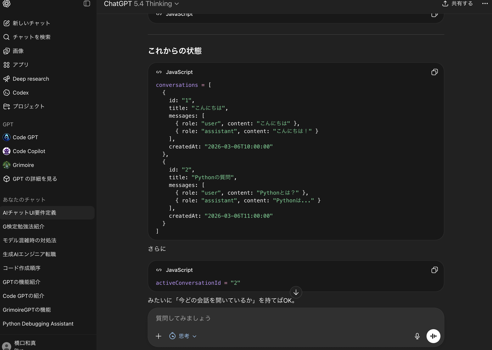

# AI Chat App (ChatGPT-like UI)

ChatGPTのようなUI/UXを目指したAIチャットアプリです。  
ストリーミング応答・自動スクロール・エラーハンドリング・IME（日本語変換）対応など、実用的なチャット体験を重視して作り込みました。

## 主な機能

- AIチャットの送受信
- ストリーミング応答表示
- 自動スクロール
- ローディング表示
- エラーハンドリング
- IME（日本語変換）対応
- ChatGPT風のUIレイアウト

## スクリーンショット 


## Demo
- Local: `http://localhost:4000/chat`

---

## 工夫した点
- リアルタイムで返答が少しずつ表示されるストリーミング応答に対応
- 送信中・失敗時・再送など、実際の利用を意識した状態管理を実装
- 日本語入力中に Enter で誤送信しないよう IME を考慮
- 自動スクロールと「最新へ」ボタンで会話を追いやすく改善
- Markdown表示とコードコピー機能で技術会話にも対応

---

## 使用技術
- フロントエンド: React + Vite
- UI: Tailwind CSS / lucide-react
- バックエンド: `/api/chat` 経由でAIへ接続
- テキスト表示: react-markdown + remark-gfm

---

## 今後の改善予定
- 会話履歴の保存機能
- モデル切り替え機能
- ファイルアップロード対応
- レスポンシブ対応の強化
- 認証機能の追加

---

## Environment Variables
`apps/web/.env.local` を作成して、以下を設定してください：

```env
OPENAI_API_KEY=your_key_here
```

## Project Structure (main)
```text
/apps/web/src/app/chat/page.jsx                 # チャット画面（UI本体：表示・入力・送信）
/apps/web/src/app/api/chat/route.js             # チャットAPI（/api/chat：OpenAIへ送信）
/apps/web/src/utils/useHandleStreamResponse.js  # ストリーミング処理（返答を少しずつ表示）
/apps/web/src/utils/useAuth.js                  # 認証関連（今後使う/拡張用）
/apps/web/src/utils/useUpload.js                # アップロード関連（今後使う/拡張用）
```

